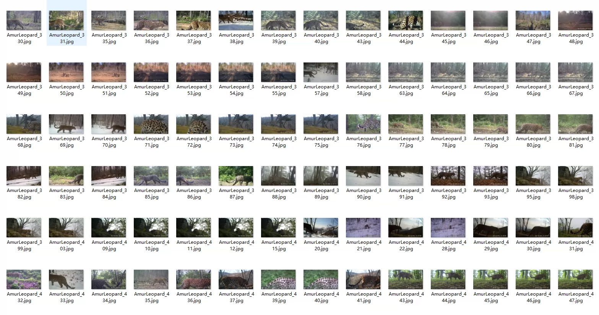
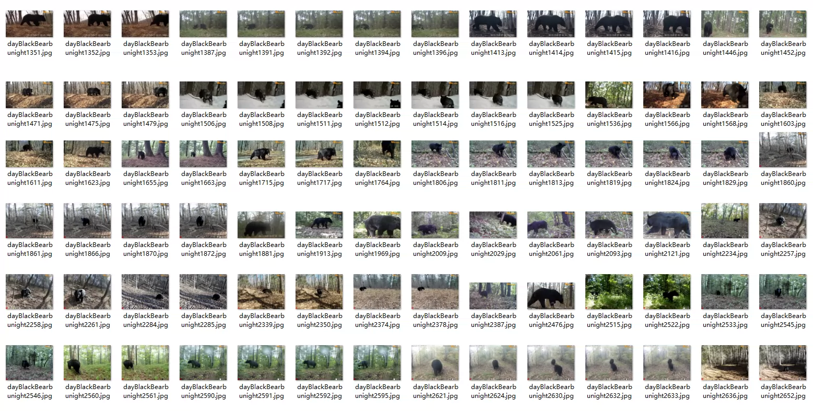
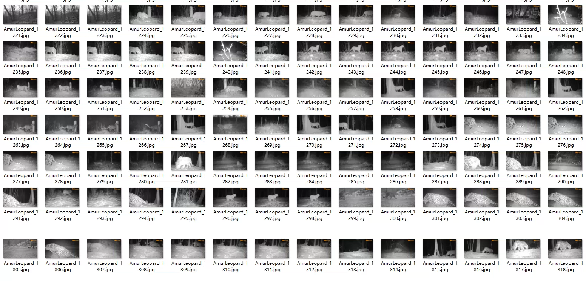
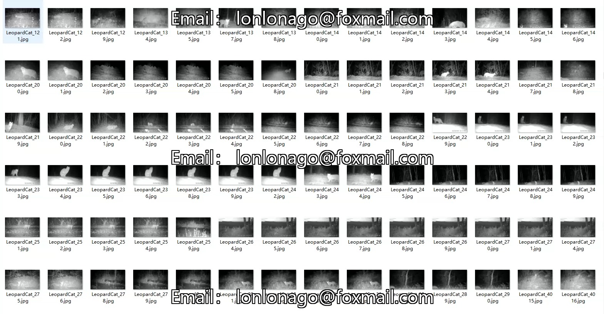
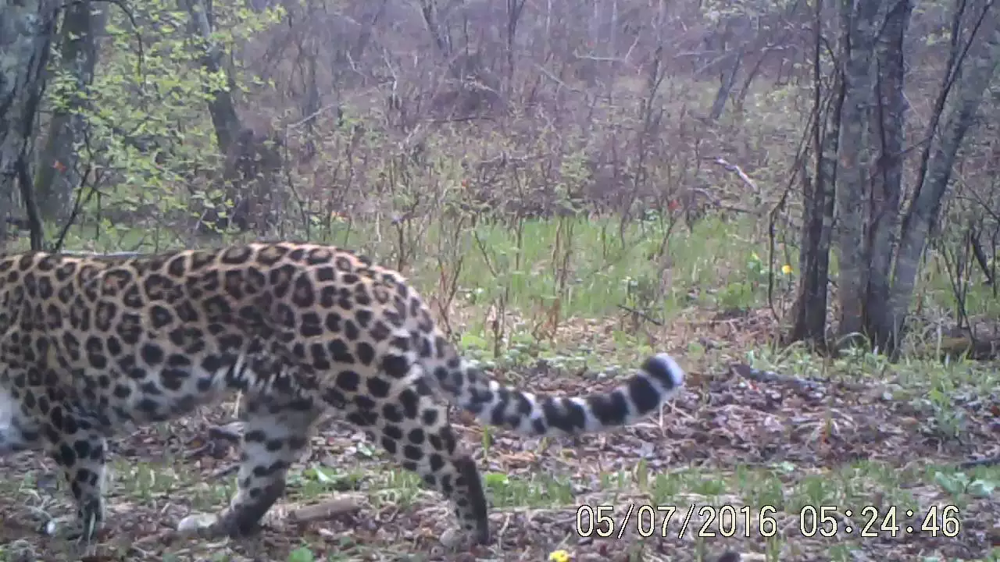
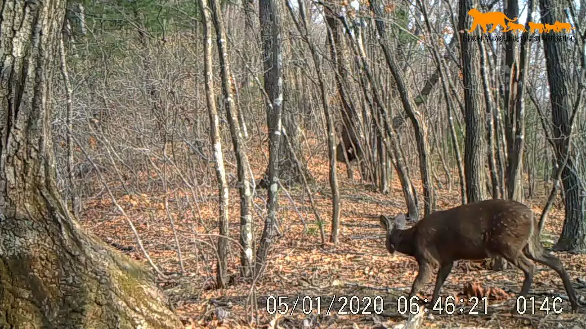
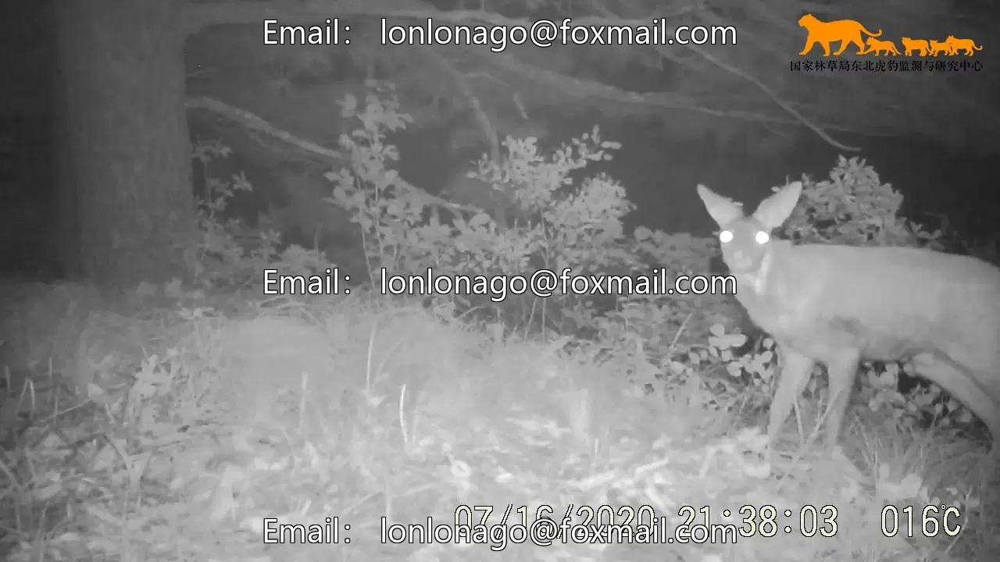
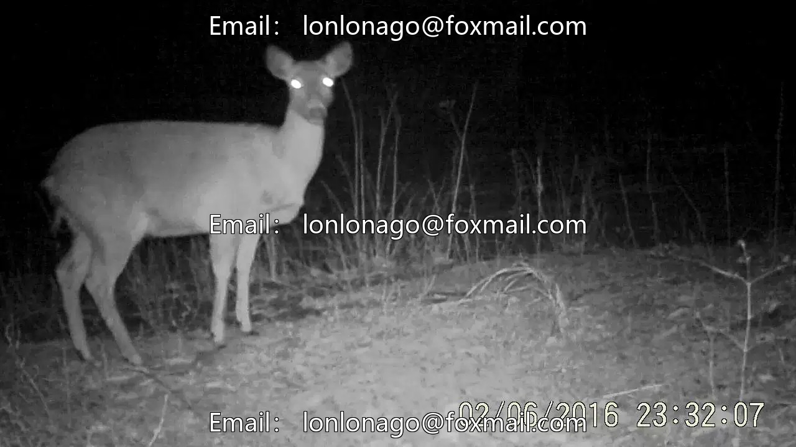

## Body

National Park Wildlife (Tiger, Leopard, Deer, Mongolian Wild Boar, Red Deer, Asian Black Bear, Red Fox, Asian Dog Deer, Hog, Musk Deer, Yellow-bellied Deer, Leopard Cat, Rabbit, Cattle, Dog) Dual-light Object Detection Dataset

Data Composition:
     Species Coverage: A total of 17 categories, including 15 wild animals + 2 domesticated animals.
     Core Species: Tiger, Leopard, Deer, Moose, Red Deer, Asian Black Bear, Red Fox, Asian Dog Deer, Hog, Musk Deer, Yellow-bellied Deer, Leopard Cat, Rabbit, Cattle, Dog

Scene Characteristics: Mixed coniferous and broadleaf forest understory environment, covering complex backgrounds, occlusions, and distant small targets, which are real monitoring difficulties in practice.

Total Image Volume: 25,657 images, 8.5G

Data Format:
    Annotation Format: Standard Pascal VOC format (each image corresponds to a .xml annotation file), directly compatible with mainstream object detection frameworks (YOLO, Faster R-CNN, SSD, etc.).

    Image Resolution: Includes 1280×720 and 1600×1200 dual resolutions, adaptable to different model input sizes.

Electronic virtual products sold without returns

## Images

Here is a pay link on Stripe ( https://buy.stripe.com/3cs8yP7sY87d0vu9AB ). Please contact me lonlonago@foxmail.com after funding $89, and I will send you a complete data files , thank you!

